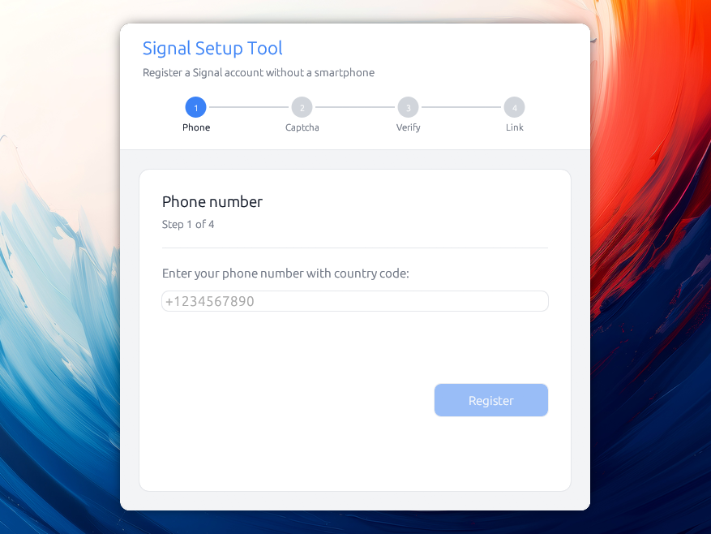

# Setup Signal without smartphone

A Desktop application to register an account with Signal and link it with
Signal Desktop, all without without requiring a smartphone.



Because it shouldn't be required to install Signal on a phone in order to use it!

*Note that Signal still requires a phone number to be used. This utility avoids the
need of a *smart*phone, but will still require a phone able to receive SMS
messages during the setup phase*

Grab [the latest release!](https://github.com/almet/signal-without-smartphone/releases)

## But, why?

There are multiple reasons why this might be interesting:

1. Some people don't have a smartphone, and they should be able to use Signal
2. Using a smartphone to register Signal means that the security of your
   messages will be as bad as the security of your smartphone. Because it's most
   of the time in your pocket, you might not want this.

## Want to build it yourself?

```bash
cargo build --release
./target/release/signal-setup
```

## Build requirements

On Linux only, a few system libraries are useful for GPU/display:

```bash
# Ubuntu / Debian
sudo apt install libxcb-render0-dev libxcb-shape0-dev libxcb-xfixes0-dev \
libxkbcommon-dev libssl-dev protobuf-compiler

# Fedora
sudo dnf install libxcb-devel libxkbcommon-devel openssl-devel protobuf-compiler

# Arch
sudo pacman -S libxcb libxkbcommon openssl protobuf
```

## License

```
Signal Without Smartphone
Copyright (C) 2026 Alexis Métaireau

This program is free software: you can redistribute it and/or modify
it under the terms of the GNU Affero General Public License as published
by the Free Software Foundation, either version 3 of the License, or
(at your option) any later version.

This program is distributed in the hope that it will be useful,
but WITHOUT ANY WARRANTY; without even the implied warranty of
MERCHANTABILITY or FITNESS FOR A PARTICULAR PURPOSE.  See the
GNU Affero General Public License for more details.

You should have received a copy of the GNU Affero General Public License
along with this program.  If not, see <https://www.gnu.org/licenses/>.
```
